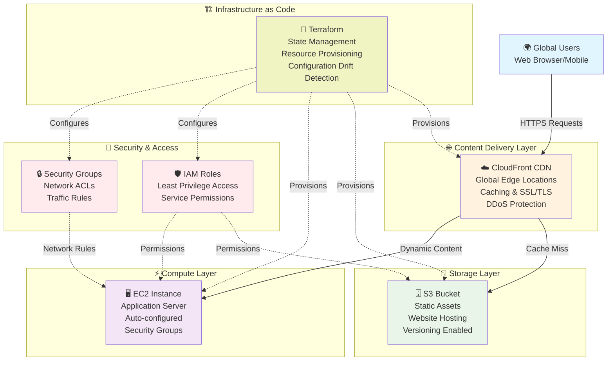

# 🚀 Terraform-AWS-Infrastructure-Automation-EC2-S3-CloudFront

**Infrastructure as Code (IaC) for scalable web applications on AWS**

[](https://terraform.io/)
[](https://aws.amazon.com/)
[](https://terraform.io/)
[](LICENSE)

---

## 📋 Table of Contents
- [Overview](#-overview)
- [Architecture](#-architecture)
- [Tech Stack](#-tech-stack)
- [Project Structure](#-project-structure)
- [Features](#-features)
- [Quick Start](#-quick-start)
- [Deployment](#-deployment)
- [Monitoring & Management](#-monitoring--management)
- [Screenshots](#-screenshots)
- [Learning Outcomes](#-learning-outcomes)
- [Best Practices](#-best-practices)

---

## 🎯 Overview

This project demonstrates enterprise-grade Infrastructure as Code (IaC) using Terraform to provision and manage a complete web application stack on AWS. The infrastructure includes compute, storage, and content delivery components designed for scalability, security, and cost optimization.

**Key Capabilities:**
- 🏗️ **Automated provisioning** of AWS resources
- 🌍 **Global content delivery** with CloudFront CDN
- 📦 **Scalable storage** with S3 integration
- 🖥️ **Flexible compute** with EC2 instances
- 🔧 **Version-controlled infrastructure** with Git

---

## 🏗 Architecture



---

## 🛠 Tech Stack

| Technology | Version | Purpose | Benefits |
|------------|---------|---------|----------|
| **🔧 Terraform** | v1.x | Infrastructure provisioning | Declarative, version-controlled, multi-cloud |
| **🖥️ AWS EC2** | Latest | Virtual compute instances | Scalable, flexible, cost-effective compute |
| **🗄️ AWS S3** | Latest | Object storage service | Unlimited storage, high durability, cost-effective |
| **☁️ AWS CloudFront** | Latest | Global CDN service | Low latency, high transfer speeds, DDoS protection |
| **🛡️ AWS IAM** | Latest | Identity & access management | Fine-grained permissions, secure access control |
| **📚 GitHub** | Latest | Version control & collaboration | Code history, branching, collaborative development |

---

## 📂 Project Structure

```
terraform-AWS-Infrastructure-Automation-EC2-S3-CloudFront/
│
├── 🏗️ infra/                      # Terraform configuration files
│   ├── main.tf                    # Primary resource definitions
│   ├── variables.tf               # Input variable declarations
│   ├── outputs.tf                 # Output value definitions
│   ├── provider.tf                # AWS provider configuration
│   └── .terraform.lock.hcl        # Dependency lock file (auto-generated)
│
├── 📸 screenshots/                 # Visual documentation
│   ├── CloudFront distribution deployed.PNG
│   ├── EC2 instance in AWS console — running with public IP and tags.PNG
│   ├── EC2-security group.PNG
│   ├── IAM-user.PNG
│   ├── Project folder structure in repository.PNG
│   ├── S3 bucket and uploaded static site files (index.html, 404.html).PNG
│   ├── Static site delivered via CloudFront (CDN).PNG
│   ├── Static site served from S3 website endpoint.PNG
│   └── Terraform plan & apply outputs - resources created and output values.PNG
│
├── 📁 site/                       # Static website files
│   ├── index.html                 # Main website page
│   └── 404.html                   # Custom error page
│
├── .gitignore                     # Git ignore patterns
└── README.md                      # This file
```

---

## ✨ Features

### 🏗️ Infrastructure Automation
- **Declarative Configuration**: Define infrastructure in code
- **State Management**: Track resource state and detect drift
- **Resource Dependencies**: Automatic dependency resolution
- **Environment Consistency**: Identical infrastructure across environments

### 🌍 Global Content Delivery
- **Edge Caching**: Reduced latency with global edge locations
- **SSL/TLS Termination**: Automatic HTTPS certificate management
- **Compression**: Automatic gzip compression for faster delivery
- **Custom Error Pages**: Professional error handling

### 🔒 Security & Compliance
- **Least Privilege Access**: Minimal required permissions
- **Network Isolation**: Security groups and NACLs
- **Encryption**: Data encryption at rest and in transit
- **Access Logging**: Comprehensive audit trails

### 📊 Monitoring & Observability
- **CloudWatch Integration**: Metrics and log aggregation
- **Cost Optimization**: Resource tagging for cost tracking
- **Health Checks**: Automated monitoring and alerting
- **Performance Metrics**: Real-time performance insights

---

## 🚀 Quick Start

### Prerequisites
- **AWS CLI** configured with appropriate credentials
- **Terraform** v1.0+ installed locally
- **Git** for version control
- **AWS Account** with sufficient permissions

### 1. Clone Repository
```bash
git clone https://github.com/yourusername/terraform-AWS-Infrastructure-Automation-EC2-S3-CloudFront.git
cd terraform-AWS-Infrastructure-Automation-EC2-S3-CloudFront/infra
```

### 2. Initialize Terraform
```bash
# Download providers and modules
terraform init

# Validate configuration syntax
terraform validate

# Format configuration files
terraform fmt
```

### 3. Deploy Infrastructure
```bash
# Preview changes
terraform plan

# Apply configuration
terraform apply

# Confirm with 'yes' when prompted
```

### 4. Verify Deployment
```bash
# Check outputs
terraform output

# Verify resources in AWS Console
```

---

## 🎯 Deployment Commands

| Command | Purpose | Usage |
|---------|---------|-------|
| `terraform init` | Initialize working directory | First-time setup, provider updates |
| `terraform validate` | Validate configuration syntax | Before planning or applying |
| `terraform plan` | Preview infrastructure changes | Review before applying changes |
| `terraform apply` | Create/update infrastructure | Deploy changes to AWS |
| `terraform destroy` | Remove all resources | Clean up when done |
| `terraform output` | Display output values | Get resource information |
| `terraform state list` | List managed resources | Inventory of current state |

---

## 📊 Monitoring & Management

### Resource Outputs
After successful deployment, access key information:

```bash
# Get all outputs
terraform output

# Specific outputs
terraform output cloudfront_domain_name
terraform output s3_bucket_name  
terraform output ec2_public_ip
```

### AWS Console Verification
1. **EC2 Dashboard** → Verify instance status and configuration
2. **S3 Console** → Check bucket creation and permissions
3. **CloudFront Console** → Validate distribution settings
4. **CloudWatch** → Monitor metrics and logs

### Cost Monitoring
- Tag-based cost allocation reports
- AWS Cost Explorer integration
- Resource-level cost tracking
- Budget alerts and notifications

---

## 📸 Screenshots

### 🏗️ Infrastructure Overview
*Complete infrastructure architecture showing all AWS services and their interactions*

### ✅ Successful Deployment
*Terraform apply command showing successful resource creation*

### 🖥️ EC2 Instance Dashboard  
*EC2 instance running with proper security group configuration*

### 🗄️ S3 Bucket Configuration
*S3 bucket with versioning enabled and proper permissions*

### ☁️ CloudFront Distribution
*CloudFront distribution with global edge locations active*

---

## 🎓 Learning Outcomes

### 🔧 Technical Skills Developed
- **Infrastructure as Code**: Mastered Terraform syntax, state management, and best practices
- **AWS Services Integration**: Learned how EC2, S3, and CloudFront work together
- **Security Implementation**: Applied AWS security best practices and IAM policies
- **Version Control**: Structured infrastructure code for team collaboration

### 🏗️ Architecture Knowledge
- **Scalable Design Patterns**: Understanding of multi-tier architecture
- **Performance Optimization**: CDN implementation for global content delivery  
- **Cost Management**: Resource tagging and cost optimization strategies
- **Disaster Recovery**: Backup strategies and infrastructure resilience

### 🚀 DevOps Practices
- **Automation**: End-to-end infrastructure automation
- **Reproducibility**: Consistent environment provisioning
- **Documentation**: Comprehensive project documentation
- **Collaboration**: Git-based infrastructure management

---

## 🛡️ Best Practices

### 🔒 Security
- Use least privilege IAM policies
- Enable encryption for data at rest and in transit
- Implement proper network segmentation
- Regular security audits and updates

### 💰 Cost Optimization
- Right-size EC2 instances based on usage
- Use S3 storage classes appropriately
- Monitor and optimize CloudFront caching
- Implement resource tagging strategy

### 🔧 Infrastructure Management
- Maintain consistent naming conventions
- Use version constraints for providers
- Implement proper state file management
- Regular backup of Terraform state

### 📊 Monitoring
- Set up CloudWatch alarms for critical metrics
- Implement comprehensive logging
- Regular infrastructure audits
- Performance monitoring and optimization

---

## 🚨 Troubleshooting

### Common Issues & Solutions

| Issue | Symptoms | Solution |
|-------|----------|----------|
| **Terraform Init Fails** | Provider download errors | Check internet connectivity, update Terraform version |
| **AWS Permissions** | Access denied errors | Verify AWS credentials and IAM permissions |
| **Resource Conflicts** | Name already exists | Use unique naming with random suffixes |
| **State File Issues** | State drift or corruption | Use terraform refresh, check state file integrity |

### Debug Commands
```bash
# Enable detailed logging
export TF_LOG=DEBUG
terraform apply

# Validate provider credentials
aws sts get-caller-identity

# Check resource state
terraform state show aws_instance.web_server
```

---

## 🤝 Contributing

We welcome contributions! Please follow these steps:

1. **Fork** the repository
2. **Create** a feature branch (`git checkout -b feature/amazing-feature`)
3. **Commit** your changes (`git commit -m 'Add amazing feature'`)
4. **Push** to the branch (`git push origin feature/amazing-feature`)
5. **Open** a Pull Request

### Development Guidelines
- Follow Terraform best practices and style guide
- Update documentation for any configuration changes
- Test changes in isolated environments
- Include screenshots for UI-related changes

---


## 🙏 Acknowledgments

- **HashiCorp Terraform** team for the excellent IaC tool
- **AWS Documentation** for comprehensive service guides
- **Terraform Registry** community for modules and examples
- **DevOps Community** for best practices and patterns

---

> *"Infrastructure as Code is not just about automation; it's about creating reliable, repeatable, and scalable systems that empower teams to innovate faster."*
